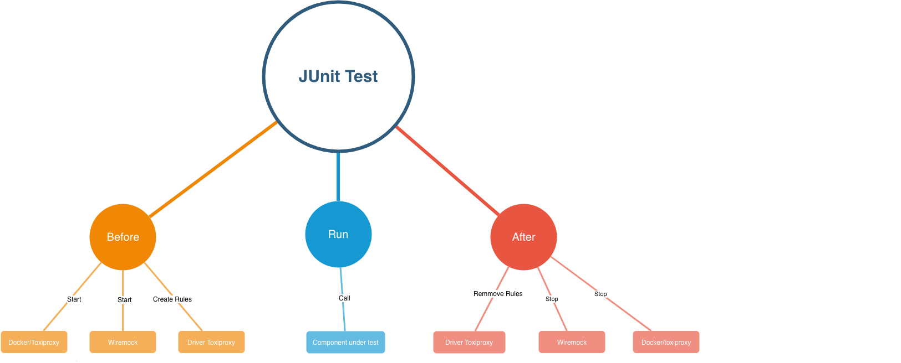

[](https://travis-ci.org/xabe/circuitBreak)
[](https://sonarcloud.io/api/project_badges/measure?project=xabe%3AcircuitBreak&metric=alert_status)
[](https://sonarcloud.io/api/project_badges/measure?project=xabe%3AcircuitBreak&metric=coverage)
[](https://sonarcloud.io/api/project_badges/measure?project=xabe%3AcircuitBreak&metric=sqale_rating)
[](https://sonarcloud.io/api/project_badges/measure?project=xabe%3AcircuitBreak&metric=sqale_index)
[](https://sonarcloud.io/api/project_badges/measure?project=xabe%3AcircuitBreak&metric=vulnerabilities)
[](https://sonarcloud.io/api/project_badges/measure?project=xabe%3AcircuitBreak&metric=duplicated_lines_density)
[](https://sonarcloud.io/api/project_badges/measure?project=xabe%3AcircuitBreak&metric=reliability_rating)
[](https://sonarcloud.io/api/project_badges/measure?project=xabe%3AcircuitBreak&metric=security_rating)
# Circuit Break

En esta ocasión vamos hablar de circuit break, como ya sabemos todo el mundo esta con los microservicios, como sabemos los microservicios deben de tener las siguientes características:

* Scalability
* Availability
* Resiliency
* Independent, autonomous
* Decentralized governance
* Failure isolation
* Auto-Provisioning
* Continuous delivery through DevOps
 
 En este ejemplo vamos hacer nuestro microservicio `resistente`, ¿Cómo? usando el patron circuit break, ¿Cómo funciona?
 en la siguiente imagen los explica muy bien
 
 
 
 
 Como vemos es muy simple pero muy potente, en el ejemplo de hoy no vamos a implentar nuestro circuit break sino usar algunas implementaciones que nos ofrence algunos frameworks.
 
 * Akka Circuit Break
 * Resilience4j
 
 Unos de los problemas que tenemos cuando tenemos configurado el circuit break en nuestro proyecto es ¿Cómo hacer las pruebas para saber si realmente fucniona?, en mi caso las únicas herramientas que conocia eran comandos de unix:
 
 * iptables (simular cadias)
 * tc (simular latencias y perdidas de paquetes de la red)
 
 Todas estas pruebas eran manuales, hasta hace un tiempo que descubrir ToxiProxy una herramienta que puede simular caidas, latencias, etc. Como funciona muy simple nos hace de proxy entre nuestra aplicación y sitio que nos queremos connectar.
 
 
 
 El ejemplo de hoy es una aplicación que llama al api de github para obtener la información de una usuario. Lo que hacer es simular que github esta caido comprobar que nuestro circuit break funciona correctamente.
 
  
 
 - [x] Grizzly como servidor NIO
 - [x] Jersey como JAX-RS
 - [x] Jackson
 - [x] Spring
 - [x] Wiremock
 - [x] Akka Circuit Break
 - [x] Resilience4j
 - [x] toxiproxy
 
 ## Requisitos
 
 * Maven 3 o superior
 * Java 8 o superior
 
 ## Inicio rápido
 
 ```
 git clone git@github.com:xabe/circuitBreak.git
 ```
 
### Como usarlo

Si estamos en Mac tenemos que instalar toxiproxy y arrancar

````
brew install toxiproxy

toxiproxy-server

mvn clean install

````

Si estamos en linux tenemos que instalar docker ya se descagar una imagen de toxyproxy

````

mvn clean install 

````