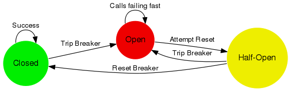

[](https://travis-ci.org/xabe/circuitBreak)
[](https://sonarcloud.io/api/project_badges/measure?project=xabe%3AcircuitBreak&metric=alert_status)
[](https://sonarcloud.io/api/project_badges/measure?project=xabe%3AcircuitBreak&metric=coverage)
[](https://sonarcloud.io/api/project_badges/measure?project=xabe%3AcircuitBreak&metric=sqale_rating)
[](https://sonarcloud.io/api/project_badges/measure?project=xabe%3AcircuitBreak&metric=sqale_index)
[](https://sonarcloud.io/api/project_badges/measure?project=xabe%3AcircuitBreak&metric=vulnerabilities)
[](https://sonarcloud.io/api/project_badges/measure?project=xabe%3AcircuitBreak&metric=duplicated_lines_density)
[](https://sonarcloud.io/api/project_badges/measure?project=xabe%3AcircuitBreak&metric=reliability_rating)
[](https://sonarcloud.io/api/project_badges/measure?project=xabe%3AcircuitBreak&metric=security_rating)
# Circuit Break

This project show how work circuit break
 
 
 
 
### How use

````
brew install toxiproxy

toxiproxy-server

mvn clean install

````